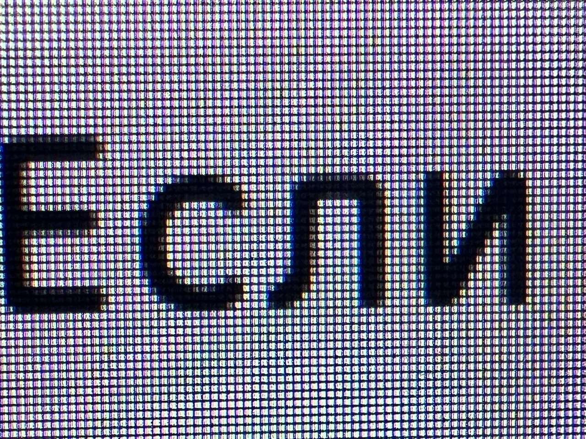

# Глава 1: Данные и информация
1. Что такое данные и информация?
2. В чем они отличаются?
3. Как можно закодировать данные?
4. История кодирования и декодирования, что было до битов и байтов?

Что такое информация — этот вопрос я задавал себе задолго до того, как стал программистом. На факультете психологии, когда мы изучали мозг я хотел понять, а чем мозг оперирует, что это такое, что мы видим, слышим, чувствуем.
У нас есть органы чувств, глаза, уши, язык, кожа, и мы постоянно что-то видим, слышим, чувствуем.
Из курса физики, химии и биологии я помнил, что видим мы свет, а свет — это электромагнитные волны.
Слышим мы звук, а звук — это колебания в воздухе.
Что-то мы чувствуем прикосновением, а прикосновение — это колебания в твёрдых телах.
Вкус - это химические реакции на молекулы в пище.

Компьютеры могут обрабатывать фото, видео и звук, то есть я могу взаимодействовать с комьютером глазами и ушами.

Больше всего за комьютером я читаю тексты, пишу программы, смотрю видео, слушаю музыку.

Что такое текст? 

Когда я пишу или печатаю текст — я соединяю буквы в слова, слова в предложения, предложения в текст, использую язык.

Например, "Привет, мир!" — это набор букв и знаков препинания.
Сообщение, **имеющее смысл**, в котором кто-то приветствует мир.

Но любой ли набор букв имеет смысл?

"Ирм тприев" — что это значит?

Я снова и снова смотрю на эту строчку и не понимаю смысла набора этих букв.

Что будет, если взять это предложение и перемешать буквы в **случайном** порядке?

Вот строка, имеющая смысл:
"Я снова и снова смотрю на эту строчку и не понимаю смысла набора этих букв."

А вот теже буквы, но в **случайном** порядке:

"нсуо иысбн мтоа рсо яссвчкто иуоьрнаи и нпде атефхе смаонлб."

Я вижу, что смысл предложения зависит от того, случайный или нет порядок букв.

Не случайный порядок — это то, что мы, люди, кто использует язык, договорились, что в таком порядке буквы будут иметь смысл.

Но что значит неслучайный?

Die — это какое слово? Если вы знаете английский, то вы знаете, что это слово означает "смерть".
А если вы знаете немецкий, то вы видите просто артикль "die".

EN: hell — ад, место мучений, выражение сильных эмоций.
DE: hell — светлый, яркий.

Чтобы понять смысл слова мне нужно знать язык, на котором оно написано помимо того, что это неслучайный набор букв. 

Ладно. А что значит не случайный все-таки? Может попробовать определить его от обратного, 
разобраться, что значит случайный?

Вспоминаю синонимы: случайный, произвольный, непредсказуемый, хаотичный.

Лучше всего термин хаос иллюстрируется на примере моего рабочего стола.

Почему энтропия, хаос возрастает? Отвечает статистика — дело в том, что варинатов порядка
на столе намного меньше, чем вариантов беспорядка.

Есть 100500 варинатов расположения файлов и только единицы варинатов, когда файлы отсортированы, дубликаты удалены и так далее.

TODO: написать про количество информации исходя из предстазуемости сообщения.
Все сообщения — данные, но предсказуемые сообщения содержат меньше информации, чем непредсказуемые.

### Как можно закодировать данные

Самое первое, что приходит в голову — нарисовать сообщение на стене.
Схематично, как позволяет талант :)

Есть языки, которые эволюционировали из рисунков. Иероглифы.

Но я намного раньше узнал про буквы, так получилось, что это была кириллица.

Что такое буква? Это линии, соединённые вместе.

Компьютер показывает текст на экране, еще текст можно распечатать.

Как показать букву на экране? Нужно на одном и том же месте показывать разные буквы, в отличие от книги, 
мы не листаем физически экран.

Если посмотреть поближе, например через камеру смартфона, то можно увидеть пиксели.

Пиксель — это маленький квадратик, который может быть окрашен в один из множества цветов.

